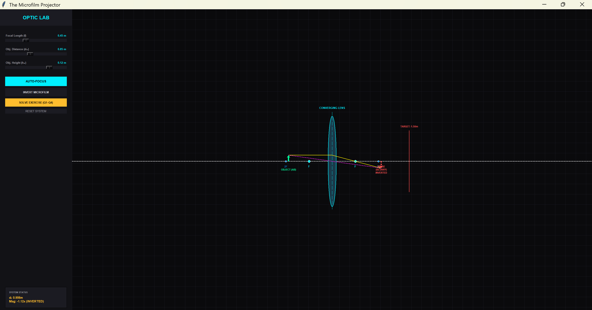
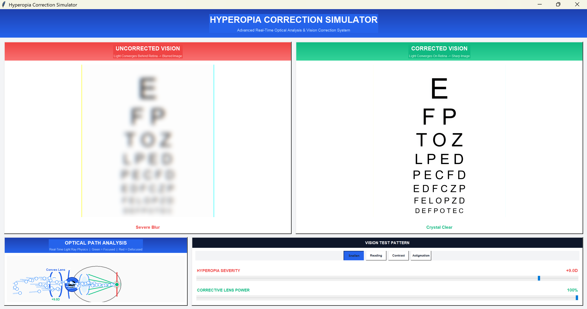
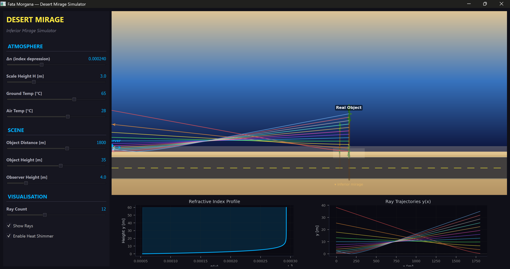
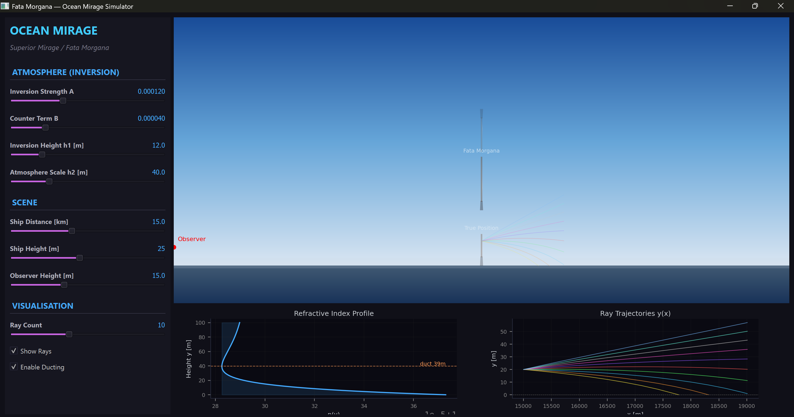

# 🔬 OOE VIRTUAL LABORATORY: OPTICAL & EM SYSTEMS
**Institution:** National Higher School of Advanced Technologies (ENSTA)  
**Module:** Physics / Computer Vision  
**Academic Year:** 2025–2026  
**Supervisor:** Dr. CHEGGOU Rabéa  

---

## 👥 TEAM IDENTIFICATION
- **Project Leader:** MESSAHLI Hiba Manel
- **Group Number:** G4
- **Team Members:**
  1. HAMMADI Nibel
  2. RAKI Meriem
  3. BENDAHMANE Reham
  4. TAKELAIT Amani
  5. BOUHEROUA Imane

---
## 📌 Project Overview

This project contains two physics simulations:

1. **The Microfilm Projector**: A converging lens system that projects a microfilm onto a wall using the thin-lens equation and transverse magnification.
2. **Atmospheric Mirages**: A numerical ray-tracing simulation of inferior (desert) and superior (Fata Morgana) mirages using RK4 integration.
3. **The Atomic Whisper**: Nano-Phononics Acoustic Triangulation — TDOA-based keystroke localization
---

## 📐 Physics Formulas Used

### 🔷 The Microfilm Projector

**Optical Power and Focal Length:**
$$P = \frac{1}{f} \quad \Rightarrow \quad f = \frac{1}{P} = \frac{1}{10} = 0.10 \text{ m} = 10 \text{ cm}$$

**Thin-Lens Equation (Gaussian form):**
$$\frac{1}{OA'} - \frac{1}{OA} = \frac{1}{f}$$

**Transverse Magnification:**
$$M = \frac{A'B'}{AB} = \frac{OA'}{OA} \approx -14$$

**Results:**
- Object distance: $OA = -10.71 \text{ cm}$
- Magnification: $M \approx -14$ (inverted, enlarged)
- Image height: $|A'B'| \approx 28 \text{ cm}$

---

### 🔷 Atmospheric Mirages – Ray Tracing

**Snell's Law (at each atmospheric layer):**
$$n_1 \sin\theta_1 = n_2 \sin\theta_2$$

**Layered Medium Invariant:**
$$n(y)\sin\psi = \text{constant}$$

**Ray Propagation Equations (from Fermat's Principle):**
$$\frac{dx}{ds} = v_x, \quad \frac{dy}{ds} = v_y$$

$$\frac{dv_x}{ds} = -\frac{v_y v_x}{n}\frac{dn}{dy}, \quad \frac{dv_y}{ds} = \frac{v_x^2}{n}\frac{dn}{dy}$$

**Desert Atmosphere Model (Inferior Mirage):**
$$n(y) = n_{\text{base}} - \Delta n \cdot e^{-y/H}$$

**Ocean Atmosphere Model (Superior Mirage / Fata Morgana):**
$$n(y) = n_{\text{base}} + A \cdot e^{-y/h_1} - B \cdot e^{-y/h_2}$$

**Phase Velocity:**
$$v = \frac{c}{n}$$

---

### 🔷 The Atomic Whisper – Acoustic Triangulation (TDOA)

**Distance from wave propagation:**
$$d_i = v_g \cdot \Delta t_i$$

**TDOA Error Minimization (Least Squares Grid Search):**
$$E(x,y) = \sum_{i} \left( \frac{||\vec{S}_i - \vec{p}||}{v_g} - \Delta t_{\text{meas},i} \right)^2$$

**Position uncertainty from noise:**
$$\sigma_{xy} \approx v_g \cdot \sigma_t$$

---

### 🔬 Simulation 1 — The Microfilm Projector (`lens_sim.py`)



This simulation models a converging lens system that projects a microfilm onto a wall placed **1.50 m** from the lens — exactly the setup described in Track 3.

**What it shows:**
- A real-time ray diagram with the object (microfilm), the converging lens, focal points F and 2F, and the projected image
- Whether the image is **in focus** (green) or **blurry** (red) relative to the target wall
- The image orientation: **upright or inverted**

**Controls:**
| Slider | What it does |
|---|---|
| Focal Length (f) | Changes the lens power |
| Object Distance (d₀) | Moves the microfilm closer or farther from the lens |
| Object Height (h₀) | Changes the size of the microfilm |

**Buttons:**
- **AUTO-FOCUS** → Automatically calculates and sets the exact object distance needed to project a sharp image on the wall
- **INVERT MICROFILM** → Flips the microfilm upside down (required in practice since M < 0)
- **SOLVE EXERCISE (Q1–Q4)** → Displays the full step-by-step solution to the Track 3 mission (focal length, object distance, magnification, image height)
- **RESET SYSTEM** → Returns all sliders to default values

**Key physics demonstrated:**
$$f = \frac{1}{P} = \frac{1}{10} = 0.10 \text{ m}, \quad OA = -10.71 \text{ cm}, \quad M \approx -14, \quad |A'B'| \approx 28 \text{ cm}$$

---

### 👁️ Simulation 2 — Hyperopia Correction Simulator (`Hyperopia_Correction.py`)



This simulation applies the **same thin-lens physics** to a real-world medical problem: correcting farsightedness (hyperopia) using a converging lens (glasses).

**What it shows:**
- **Left panel (red):** Uncorrected vision — the image forms *behind* the retina, causing blur. The blur intensity increases with hyperopia severity.
- **Right panel (green):** Corrected vision — a converging lens shifts the focus forward onto the retina, restoring a sharp image.
- **Bottom-left:** Optical path diagram showing how rays converge with and without the corrective lens.
- **Bottom-right:** A vision test chart (Snellen, Reading, Contrast, Astigmatism) that reacts in real time to the correction level.

**Controls:**
| Slider | What it does |
|---|---|
| Hyperopia Severity | Simulates how far behind the retina the focus falls (in diopters) |
| Corrective Lens Power | Adds optical power to shift the image forward onto the retina |

**Connection to Track 3 physics:**

Both simulations use the same fundamental equations:

$$\frac{1}{d_o} + \frac{1}{d_i} = \frac{1}{f}, \qquad m = -\frac{d_i}{d_o}, \qquad P = \frac{1}{f}$$

In the projector, we move the image **far away** onto a wall. In hyperopia correction, we move the image **forward** onto the retina. Same lens equation, two different real-world applications.

---

## 🌅 Simulation 3 — Desert Mirage / Inferior Mirage



This simulation models the **inferior mirage** — the "water on the road" effect seen on hot desert surfaces. It uses RK4 numerical ray tracing through a realistic atmosphere model.

**What it shows:**
- A desert scene with light rays bending **upward** near the hot ground
- The **real object** position vs the apparent mirage image below it
- Bottom-left: the **Refractive Index Profile** n(y) — sharp drop near the ground
- Bottom-right: **Ray Trajectories** y(x) — rays curving upward due to the gradient

**Atmosphere model used:**
$$n(y) = n_{\text{base}} - \Delta n \cdot e^{-y/H}$$

**Controls:**
| Slider | What it does |
|---|---|
| Δn (index depression) | Strength of the refractive index gradient near the ground |
| Scale Height H [m] | How quickly the hot air effect fades with height |
| Ground Temp [°C] | Temperature at the surface (drives the gradient) |
| Air Temp [°C] | Ambient air temperature above |
| Object Distance [m] | How far away the real object is |
| Object Height [m] | Height of the object |
| Observer Height [m] | Height of the observer's eye |
| Ray Count | Number of rays traced simultaneously |

**Checkboxes:**
- **Show Rays** → Toggle ray visibility on the scene
- **Enable Heat Shimmer** → Adds realistic flickering effect to the mirage

---

## 🌊 Simulation 4 — Ocean Mirage / Fata Morgana



This simulation models the **superior mirage (Fata Morgana)** — an optical phenomenon seen over cold oceans where distant objects appear lifted, stretched, or duplicated. Uses RK4 integration with a dual-exponential atmosphere model.

**What it shows:**
- An ocean scene with a **ship** appearing elevated above its true position
- The **Fata Morgana** label marks the mirage image, **True Position** marks reality
- Colored rays from the observer showing how light bends through the inversion layer
- Bottom-left: **Refractive Index Profile** with the characteristic inversion "kink"
- Bottom-right: **Ray Trajectories** showing ducting behavior near the surface

**Atmosphere model used:**
$$n(y) = n_{\text{base}} + A \cdot e^{-y/h_1} - B \cdot e^{-y/h_2}$$

**Controls:**
| Slider | What it does |
|---|---|
| Inversion Strength A | Strength of the cold dense air layer near the surface |
| Counter Term B | Controls the normal density decrease with altitude |
| Inversion Height h1 [m] | Scale height of the cold surface layer |
| Atmosphere Scale h2 [m] | Scale height of the upper atmosphere decay |
| Ship Distance [km] | How far away the ship is from the observer |
| Ship Height [m] | Real height of the ship |
| Observer Height [m] | Height of the observer above sea level |
| Ray Count | Number of rays to trace |

**Checkboxes:**
- **Show Rays** → Toggle ray visibility
- **Enable Ducting** → Allows rays to be trapped inside the inversion layer

---

### 🔊 Simulation 5 — The Atomic Whisper: Acoustic Triangulation (`simulation.py`)


This simulation demonstrates how a **keystroke on a solid plate** generates mechanical waves detected by sensors, which are then used to **triangulate the exact key pressed** — using TDOA (Time Difference of Arrival) physics.

**What it shows:**
- A full keyboard layout on a plate with **4 sensors (S1–S4)** at the corners
- A glowing **heatmap** showing the TDOA error field — brightest point is the wave origin
- **Animated propagation rings** spreading outward from the detected key
- The **highlighted key** that was triangulated in real time
- Right panel: full telemetry (TDOA values, coordinates, error) and decoded output in HEX and binary

**Physics model used:**
$$
d_i = v_g \cdot \Delta t_i
$$

$$
E(x,y) = \sum_{i} \left( \frac{||\vec{S}_i - \vec{p}||}{v_g} - \Delta t_{\text{meas},i} \right)^2
$$

**Parameters:**
| Parameter | Value |
|---|---|
| Wave group velocity vg | 600 m/s |
| Sensor noise std | 4 µs |
| Grid resolution | 220 × 220 points |
| Number of sensors | 4 (corner-placed) |

**How to interact:**
- **Press any keyboard key** (Q–P, A–L, Z–M) → simulation triangulates and highlights it instantly
- **Click on any key** on the plate diagram with the mouse → same result

**Decoded output example:**
KEY NODE    :  'J'
RECON HEX   :   0x4A
RECON BINARY:   0b01001010

**Real-world applications:**
- Keyboard side-channel attack via vibration analysis
- Assistive surface-tap interfaces
- Smart door knock localization
- Interactive wall tap detection

---

## ▶️ How to Run All Simulations

**Requirements:** Python 3.x — install dependencies with:
```bash
pip install numpy matplotlib tkinter
```
```bash
# Microfilm Projector
python lens_sim.py

# Hyperopia Correction
python Hyperopia_Correction.py

# Desert / Inferior Mirage
cd Numerical-Simulation-of-Inferior-and-Superior-Atmospheric-Mirages/feta_morgana/desert_mirage
python main.py

# Ocean / Superior Mirage (Fata Morgana)
cd Numerical-Simulation-of-Inferior-and-Superior-Atmospheric-Mirages/feta_morgana/ocean_mirage
python main.py

# Simulation 5 — The Atomic Whisper
python simulation.py

```

---

## 🚀 Live Demo

| Simulation | Link |
|---|---|
| 🔬 Microfilm Projector (HTML/JS) | [Open Simulation](https://nibaruu.github.io/microfilm-p/) |
| 👁️ Hyperopia Correction | |
| 🏜️ Desert Mirage |  |
| 🌊 Ocean Mirage / Fata Morgana |  |
